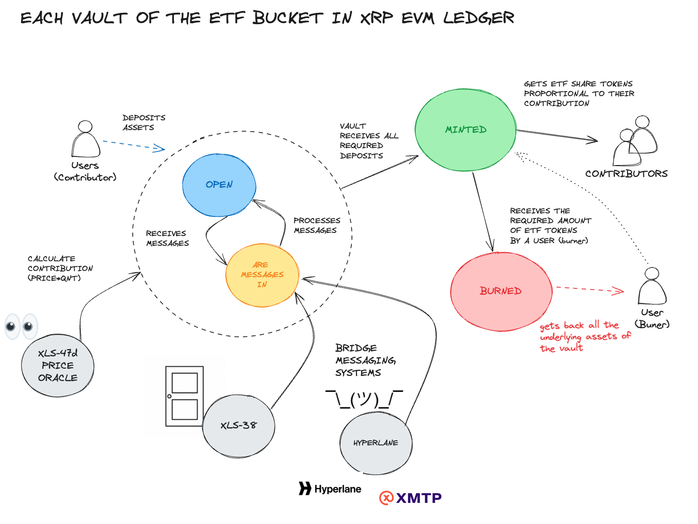
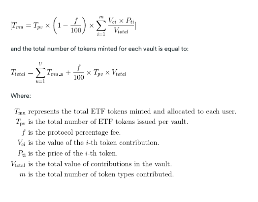
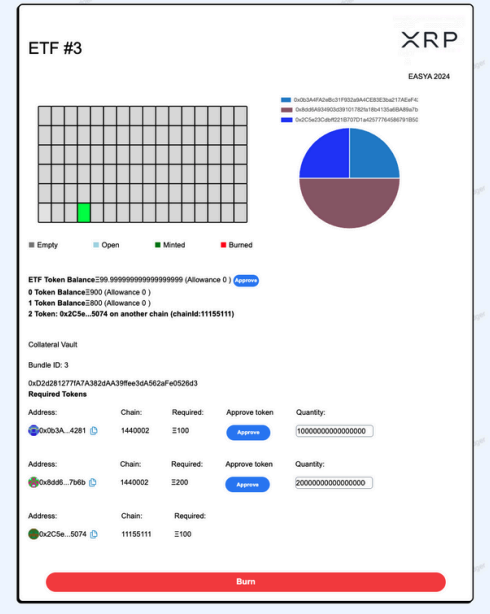

# XTF PROTOCOL on XRP LEDGER


[XTFLabs Website](https://www.xtflabs.com)

[Gaetano's contact](https://www.linkedin.com/in/gaetano-mondelli/)


Terms used in this context from https://opensource.ripple.com/

**Currency**: The currency used by the bridge. Depending on the token, the bridge has different setups. If the currency is XRP, the door account is called a Native Bridge Door ; if the currency is a token, the door account is called a Token Bridge Door .
**Locking Chain**: The chain where the token originally exists. If the locking chain is an XRPL chain, the bridge IOU issuer isn't the bridge door account. If the locking chain is an EVM chain, the ERC20 owner isn't the bridge door account.
**Issuing Chain**: The chain the token is bridged to. If the issuing chain is an XRPL chain, the bridged IOU issuer is the bridge door account. If the issuing chain is an EVM chain, the bridged ERC20 owner is the bridge door account and can mint/burn tokens.
**Owners**: The witnesses addresses. For each witness, you must have its address on both chains.
**Threshold**: The amount of attestations needed for each operation.
**Signautre Reward**: The reward distributed to witnesses for providing attestations.
**Minimum Create Account**: For native XRP bridg


## EASYA LONDON HACKATON 

[EasyA Hackhaton Winner](https://www.linkedin.com/posts/easya_xrp-xrp-xrp-activity-7185968249539338240-hPnS?utm_source=share&utm_medium=member_desktop)

🏆 1st Place on the Technical track.


### Hackhaton Submission Form 

XTF, or Decentralized Exchange-Traded Fund, reinterprets traditional ETFs for the cryptocurrency market by offering a DeFi solution that simplifies access to a diversified, multichain asset portfolio. 

In traditional finance, central organizations aggregate large amount of assets into a single bucket and then fractionalize it into shares (e.g. ETFs). We purchase these shares to gain exposure to the underlying assets selected by experts. Similarly, in XTF, we break down the large bucket into smaller vaults, each mirroring the same asset composition but on a smaller scale. This allows anyone—not just central organizations—to contribute to a vault's asset collection and receive ETF share tokens in exchange.

Assets are securely and transparently stored across different blockchains. We use bridges and a messaging protocol to wrap tokens or track assets that have been locked for a vault on other EVM chains in the XRP Ledger EVM chain, which maintains the global state. 
When all the assets required by a vault are collected across all the chains, ETF token shares are issued on the XRP Ledger EVM, proportional to each contributor's investment in the vault. The contribution to each vault depends on the quantity deposited and the price of the deposited assets when the vault is completed. Prices are fetched upon vault completion by secure and trusted Price Oracles.

Contributors who receive ETF token shares gain instant exposure to all the multichain assets tracked by that specific token index. 
Unlike traditional finance, we also allow for the process to be reversed, enabling users to exchange ETF share tokens back for the underlying assets.

Our business model focuses on fees collected both when ETF share tokens are created at vault creation and redeemed, which provides us with exposure to all the underlying assets. Additionally, our rebalancing strategy offers potential revenue opportunities. We are also considering the possibility of creating a token protocol used for operations or for the governance of the protocol.

We aim to bridge traditional finance and crypto, simplifying access to diversified technology and offering greater control and flexibility. Future developments will include a DEX connection to allow users to complete vaults with the tokens they own (which will be exchanged for the required ones by a DEX behind the scenes) and the use of an account abstraction solution (ERC-4337) to completely remove the complexity of managing a wallet.

#### Summary Technical description


Smart contract development used Hardhat, with core unit tests (found in the test folder) to verify the contract functionalities. Deployment scripts proved challenging and ultimately required implementing waiting times on the XRP Ledger EVM Sidechain. We discovered that in contexts where multiple contracts had to be deployed, it was easy to encounter inconsistencies in nonce synchronization between the local wallet nonce manager and the XRP EVM node.

Since assets are securely and transparently stored across different blockchains, we are using QuickNode to access a dedicated Sepolia node. A dedicated node for XRP was not necessary during development as the provided RPC URL was sufficient to handle all the traffic. We use the Door Token Bridge (XLS-38) to wrap tokens from the XRP Mainnet, and we have developed a messaging protocol using Hyperlane (https://docs.hyperlane.xyz/) that tracks blockchain asset collections from other EVM chains to the XRP Ledger EVM chain. I created a script that automatically clones the Hyperlane bridge, builds it in Rust, and runs all the required bridge components within one script : the transaction validators for transactions on the XRP Ledger EVM chain; the transaction validator for Sepolia; and the relayer that moves validated messages across the two chains.(https://github.com/GaetanoMondelli/XRPLEDGER-2024/blob/main/initialise_bridge.sh)

When all the assets required by a vault are collected, ETF token shares are issued on the XRP Ledger EVM proportional to each vault contributor's investment. The contribution to each vault depends on the quantity deposited and the price of the deposited assets when the vault is completed. For this demo, we have deployed a mock oracle using the standardized `ChainLinkV3Aggregator` that fetches data from the Mainnet price oracle, which will be ported to the XRPL EVM Sidechain.


# 🏗 XTF PROTOCOL

## Description

XTF is a multichain and decentralised version of TradFi ETF.  XTF divides the ETF large bucket into smaller vaults, each mirroring the same asset mix on a smaller scale. This structure allows anyone -not only large organizations- to contribute to a vault’s asset collection and receive ETF share tokens in return. Assets are securely and transparently stored across different chains. We utilise bridges (Hyperlane and [XLS-38](https://github.com/XRPLF/XRPL-Standards/discussions/92) for token bridges)  to track assets locked on other chains in XRP evm Ledger. 

When all the assets required by a vault are collected on all chains, ETF token shares are issued on XRP evm Ledger. The issuance is proportional to each contributor’s investment in the vault. The contribution to each vault depends on the quantity of assets deposited and the price of these assets at the time the vault is completed. Prices will be fetched upon vault completion using [XLS-47](https://github.com/XRPLF/XRPL-Standards/discussions/129).


# First implementation we wrapped tokens on Locking Chain and we do not port wrapped tokens

Alternatlively we can implement a messaging system that is not wrapping tokens so we can have 1:1 messages and 1:n messgaes (Broadcast)
Chainlink - CCIP is the leader for x-chains messanging solution XRP Legder is not supported by Chainlink. So we can deploy a Hyperlane bridge for this demo

Before deploying a bridge, familiarize yourself with the parameters and terms used:

----


# XTF ARCHITECTURE




XTF is a multichain protocol, so similar contracts are deployed to different chains. However, we distinguish:

- **Issuing chain**: The chain that tracks the global state of the assets across chains. It also issues ETF share tokens on vault completion and is the only chain that can burn a vault. In this demo example, **XRP evm LEDGER** is going to be our issuing chain.

- **Locking chain**: Other chains where assets are blocked. After each deposit, they notify the Issuing chain. Assets can only be released if the issuing chain sends a *burn* message to them. In this demo example, **XRP evm LEDGER** is going to be our side chain.

---

XTF splits the large ETF bucket into smaller vaults to make investments more manageable. This diagram shows the lifecycle of each vault:

- **Empty**: Initially, the vault is empty, and users can deposit assets.
- **Open**: Some users have deposited assets on the issuing chain or on some of the tracked side chains.
- **Minted**: All the required assets have been deposited, the underlying assets have been locked, and ETF share tokens have been issued to contributors proportionally to their contributions.
- **Burned**: A user has decided to exchange a determined amount of ETF share tokens back for the underlying assets of the vault.


---

We mentioned that XTF is multi-chain, so we need messages to be exchanged between chains. To achieve that in this demo, we deployed a [Hyperlane](https://www.hyperlane.xyz/) bridge between Sepolia and XRP Ledger. I have included a convenient [script](/initialise_bridge.sh) that clones the Hyperlane bridge repository, installs Rust, builds the bridge, and runs three components within the same script. It will also handle the script exit by waiting for the processes to exit:

**Sepolia Validator**: This component has a trusted account that, when it sees certain events being emitted, will look up the transaction with the message to exchange, sign it, and make it available to be bridged.
**XRP LEDGER Validator**: Same as the Sepolia validator but for XRP evm Ledger.
**Relayer {Sepolia, XRP LEDGER}**: Every time a validator makes validated messages available, it will bridge them to the destination chain.
In the following [folder](bridge/configs), we can find the configuration files used to set up the bridge between XRP Ledger and Sepolia and the security model used in this configuration.


The supported messages are:

- **Deposit**: From a lockchain (Sepolia) to issuing chain (XRP Ledger), to inform the issuing chain that a deposit has been made in the sidechain.
- **Burn**: From issuing chain (XRP Ledger) to locking chains (Sepolia), to inform a locking chains that a vault has been burned.
Hyperlane bridges always invoke the handle function with the message. Based on the message, the chain can execute code.


```java 
// need to refactor to 1 contract
function handle(
		uint32 _origin,
		bytes32 _sender,
		bytes calldata _message
	) external payable {
    
    ...

		if(isIssuingChain()) {
			DepositInfo memory _depositInfo = abi.decode(_message, (DepositInfo));
			_deposit(_depositInfo, chainId);
			return;
		}
		else if(!isIssuing()) {
			uint256 _vaultId = abi.decode(_message, (uint256));
			burn(_vaultId);
		}
	}

```

---

# TOKENOMICS

We also mentioned that when a vault is minted, we need to establish how many ETF Share tokens each user is getting based on their contribution to that vault. The following formula shows how TMU (total ETF minted per user) is calculated:





For calculating the price of each token (PTi), we use price oracles. In this example, we used a ChainLink V3 interface but in the future we will use more reliable native services as per [XLS-47](https://github.com/XRPLF/XRPL-Standards/discussions/129).

[ETF contract issuing chain](/packages/hardhat/contracts/ETFIssuingChain.sol)

[ETF contract locking chain](/packages/hardhat/contracts/ETFLockingChain.sol)

```java
contract ETFIssuingChain  {

  ...

	function _deposit(
		DepositInfo memory _depositInfo,
		uint32 _chainId
	) internal

		if (isMainChain()) {
				if (accountContributionsPerVault[_vaultId][_tokens[i]._contributor] == 0) {
					contributorsByVault[_vaultId].push(_tokens[i]._contributor);
				}

			uint256 price = AggregatorV3Interface(_tokens[i]._aggretator).latestRoundData().answer;

			(, /* uint80 roundID */ int answer, , , ) = AggregatorV3Interface(
				_tokens[i]._aggregator
			).latestRoundData();

			accountContributionsPerVault[_vaultId][msg.sender] += _tokens[i]
				._quantity * answer;

...
\\ Or using ChainLink  


```

Please note that for this demo the ChainLink oracle is always returning a fixed value decided during deployment.

[MockAggregator.sol](/packages/hardhat/contracts/MockAggregator.sol)


# TECH STACH


For this demo, I utilizsd Scaffold-Eth to quickly set up a Hardhat project connected to a Next.js React application. This is used with Viem and Wagmi, allowing automatic interaction with the contracts. Additional frontend libraries and resources were employed to improve the user interface, including the Ant Design (antd) React framework, Neobrutalism CSS theme, ApexCharts for vault selection, and React Chart.js for the pie chart.
Since assets are securely and transparently stored across different blockchains, we are using QuickNode to access a dedicated Sepolia node. A dedicated node for XRP evm Ledger was not necessary during development as the provided RPC URL was sufficient to handle all the traffic.


# Contracts: 

- `ETFLock.sol`: The contract used by both the mainchain and sidechain to handle the deposit of assets, contributions calculation, message exchange, and ETF share token issuance.
- `SimpleERC20.sol`: A simple OpenZeppelin ERC20 token implementation used for representing the assets in the index tracked by the vaults and the ETF share token.
- `ETFSide.sol`: The initial implementation for the ETF lock to be deployed on sidechains.
- `ExampleRedstoneShowroom.sol` & `Rapid.Sol`: Examples of a Redstone contract using Redstone that requires wrapping the library in the frontend. The library was not fully compatible with this version of Scaffold-Eth, and it was much easier to use the Chainlink aggregator for this demo.
- `HyperlaneMessageReceiver.sol`: An example of a Hyperlane-compatible message receiver.
- `HyperlaneMessageSender.sol`: An example of a Hyperlane-compatible message sender.
- `MockAggregator.sol`: A contract implementing the `AggregatorV3Interface` from Chainlink. This is how a price oracle would look like if XRP Ledger was supported by Chainlink Data Feed.
- `MockRouter.sol` & `TestMailBox.sol`: Mock router for unit-testing the Hyperlane bridge.

# TEST

The [ETFLock.test](packages/hardhat/test/ETFIssuingChain.ts) checks basic construction and operations of the ETF lock. 

# HOOKS

XTF wants to encourage a robust and flexible system for managing index funds. Hooks enable XTF to implement custom business logic, enhance security, and ensure seamless interaction with other protocols and chains. This modularity and flexibility are crucial for adapting to the dynamic nature of DeFi and for providing users with a reliable and feature-rich investment platform.
Hooks in [Uniswap v4](https://docs.uniswap.org/contracts/v4/overview) are a powerful feature that allows developers to introduce custom logic at various stages of a transaction’s lifecycle. They provide a way to extend the protocol's functionality without modifying its core code, making it highly modular and flexible. These hooks can be utilized to perform actions such as validating transactions, updating states, or integrating with external systems, enhancing the protocol’s capability and adaptability. Here are some [examples for Uniswap v4](https://github.com/ora-io/awesome-uniswap-hooks)


In Uniswap v4, hooks are important because they enable:

- Custom Logic implementation: Devs can add logic to transactions, enabling more complex strategies and interactions.
- Enhanced Security: Hooks can be used to implement additional security checks, ensuring transactions meet certain criteria before proceeding (for example to mitigate Oracle price manipulation) 
- Interoperability: By integrating with other protocols or external data sources, hooks can help create more interconnected and functional DeFi ecosystems outside the single chain. 

For XTF’s ETF funds, hooks are equally important. Here is how they can be used:


1. _START_CONTRIBUTION and _START_CONTRIBUTION_EXTERNAL_CHAIN:
	- Hook: Pre-contribution hook.
	- Usage: Validate and initialize contributions from primary and external chains, ensuring that all necessary prerequisites are met before the state transition.
2. _REACH_FULL_PRIMARY_CHAINS and _REACH_FULL_SIDECHAINS:
	- Hook: Contribution completion hook.
	- Usage: Trigger actions when contributions reach the required thresholds. This can include logging, notifications, or executing specific business logic like asset rebalancing.
3. _DISTRIBUTE_ETFTOKENS_TO_CONTRIBUTORS and _MINT_NFT_VOTE/GOVERNANCE TOKEN:
	- Hook: Token distribution hook.
	- Usage: Ensure accurate distribution of ETF tokens and minting of governance tokens. Additionally checks or state updates can be performed here to ensure integrity and compliance.
4. _LOCK_PERIOD:
	- Hook: Lock period initiation hook.
	- Usage: Apply custom logic at the start of the lock period, such as setting up timers, logging, or initializing state variables relevant to the lock period.
5. _ENABLE_REDEMPTION:
	- Hook: Redemption enablement hook.
	- Usage: Perform checks and update states to allow redemption, ensuring that all conditions are met before users can redeem their tokens.
6. _BURN_ETF_VOTES and _BURN_NFT_VOTE:
	- Hook: Pre-redeeming hook.
	- Possible Usage: Validate the burn actions, ensuring that the votes or tokens being burned are legitimate and that the redemption process is securely initiated.


# INDEX AGGREGATOR

The Index Aggregator for XTF is designed to address the lack of oracles that provide reliable top N token lists by specific metrics, e.g. market cap. This  approach leverages price oracles to store historical price data, connects smart contracts to monitor token supplies, and integrates with decentralized exchanges (DEXs) like Uniswap to evaluate liquidity. Additionally, it connects with other smart contracts to assess the usage of tokens in various protocols, providing a comprehensive and distributed method for creating accurate and reliable indexes.
XTF can later use indexes and weights to define funds allocation for each vault.

The aggregator’s functionality includes:

1. **Market Cap Calculation**: By using price oracles and monitoring token supplies, the Index Aggregator can calculate the market cap of various tokens over time. This ensures that the top N tokens are determined based on real-time and historical data aggregated.
2. **Liquidity Evaluation**: Connecting with DEXs allows the aggregator to evaluate the liquidity of tokens, ensuring that only those with sufficient liquidity are included in the indexes. This is crucial for maintaining the integrity and reliability of the ETF funds.
3. Protocol Integration: The aggregator can connect with other smart contracts to monitor staked or utilized tokens in different protocols, providing a more holistic view of the token’s market presence and utility. For example, looking if a token is staked or used in a certain way by certain protocols.
4. **Tagging System**: Facilitating the creation of category-specific indexes, the aggregator includes a tagging system. This allows for the creation of indexes based on specific categories, such as DeFi, AI tokens, meme coins, etc., enabling more tailored and diversified investment options. This might be implemented using a voting system or TLS oracles*
5. **Weighting System**: The aggregator offers customizable weighting systems to allocate the required amount for each token and its percentage within an ETF small vault. This flexibility allows for the creation of balanced and strategically weighted ETF funds.

The aggregator's goal is to enable the creation of passive ETF funds using these indexes and weighting systems, eliminating the need for third-party trusted providers to generate lists and indexes. Competitors had to create partnerships with trusted entities like Bankless, Defi-Pulse. By doing so, XTF ensures a decentralized, transparent, and trustless approach to index and ETF fund creation, empowering investors with a more secure and autonomous investment solution. This method not only enhances the reliability of the indexes but also provides greater flexibility and control to the investors, aligning with the core principles of decentralization and transparency in the crypto space.

# INTERFACE




The UI was built using [Scaffold eth 2.0](https://github.com/scaffold-eth/scaffold-eth-2) and frontened uses Next.js with React.js. React blockhain hooks to query evm hains were built using `wagmi` and low level interactions were made using `viem`.

The interface displays a large box representing the ETF assets pool, which is divided into smaller vaults to make deposits more manageable. Users can deposit any required tokens into any vault if:
- The vault state is either EMPTY or OPEN (indicated by gray, blue, or orange colors).
- The token is listed in the index (see the required tokens section).
- The deposited token amount does not exceed the required quantity.

``` 
STATES ={
	EMPTY: "No deposit has been made",
	OPEN: "Some deposit have been made",
	MINTED: "All the required deposit have been made, ETF share tokens have been issued to vault's contributors",
	BURNED: "A user has exhanged the right amount of ETF share tokens for redeeming the underlying assets"
}
```

Users are not required to deposit the full amount initially; however, minimum investment thresholds may be introduced in the future to prevent spam. Once all required assets are collected, the vault state changes to MINTED and is highlighted in green. ETF Share tokens are then issued based on the contributions, calculated using Redstone or Chainlink price oracles. The balance of the ETF tokens is shown at the top of the [token balances/allowance section](/packages/nextjs/app/etf/_components/tokenBalanceAllowance.tsx) below the matrix.

Vault inspection and asset details are accessible by clicking on any vault in the matrix. The [pie chart](/packages/nextjs/app/etf/_components/PieToken.tsx) displays the value allocation of assets. Precise quantities can be checked by hovering the mouse over the pie chart.

The bottom section, known as the [Required Token Section](/packages/nextjs/app/etf/_components/DepositController.tsx), provides information on which assets are needed, their quantities, and on which blockchain they reside. Users can edit the quantity they wish to deposit, and for assets on other chains, they can conveniently press the "Select Chain" button to switch chains and display the sidechain contract related to the ETF. This section also allows users to check if they have sufficient allowance for this contract and, if necessary, increase it by clicking "APPROVE" in the required token section.

Finally, the last section includes the [action button](/packages/nextjs/app/etf/_components/DepositButton.tsx), which displays different operations depending on the chain and vault state:

- Vault [IssuingChain, OPEN | EMPTY] => [Deposit]
- Vault [IssuingChain, MINTED] => [Burn]
- Vault [IssuingChain, BURNED] => []
- Vault [LockingChain, OPEN | EMPTY] => [Deposit, Return to IssuingChain]
- Vault [LockingChain, MINTED] => [Return to IssuingChain]
- Vault [LockingChain, BURNED] => [Return to IssuingChain]


# DEPLOYMENT Script


The following [deployment script](/packages/hardhat/deploy/00_deploy_etf.ts) deploys all the required assets to run the demo. Note that some pieces were commented out because you run that script in multiple runs.

1. First, you deploy the issuing chain XRP evm Ledger contract with npm run deploy-xrpl, which deploys all required asset tokens in that chain along with price oracles if required.
2. Then, you set the issuing chain ETFIssuingChain address as a constructor parameter for the ETFIssuingChain contract in Sepolia.
3. You then run the same script with npm run deploy-sepolia.
4. Finally, we need to re-run the XRP evm Ledger part with npm run deploy-xrpl, commenting out the deployment part (to avoid the creation of a new instance) and commenting out the part where we set the locking chain parameter with the address of the locking chain contract deployed in Sepolia.
This information is needed to route messages between different chains.

---

# OPEN ISSUES

1. Hyperlane's Bridge sometimes loses some messgaes (https://discord.com/channels/935678348330434570/1226115716957208586) **Mitigation**: Protocol messages to be idempotent to be message-lost-issues resistant 
